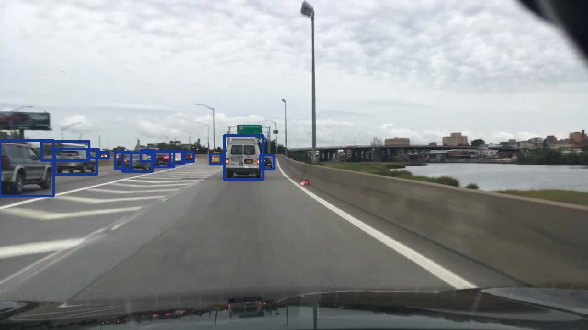
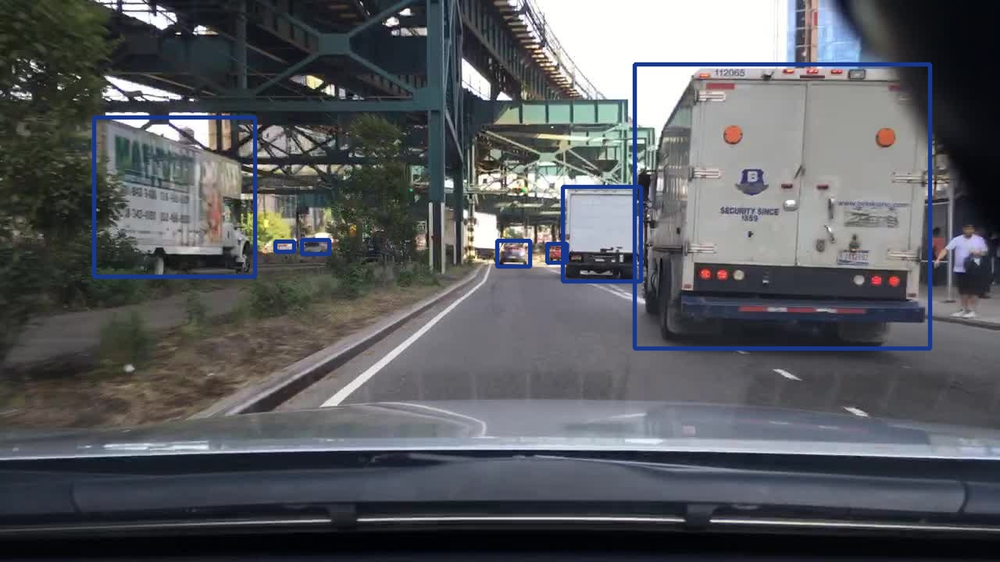
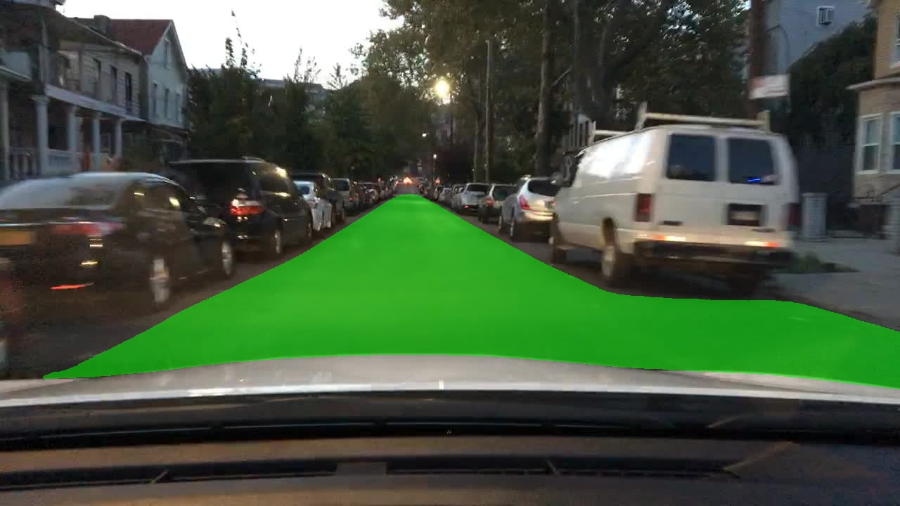
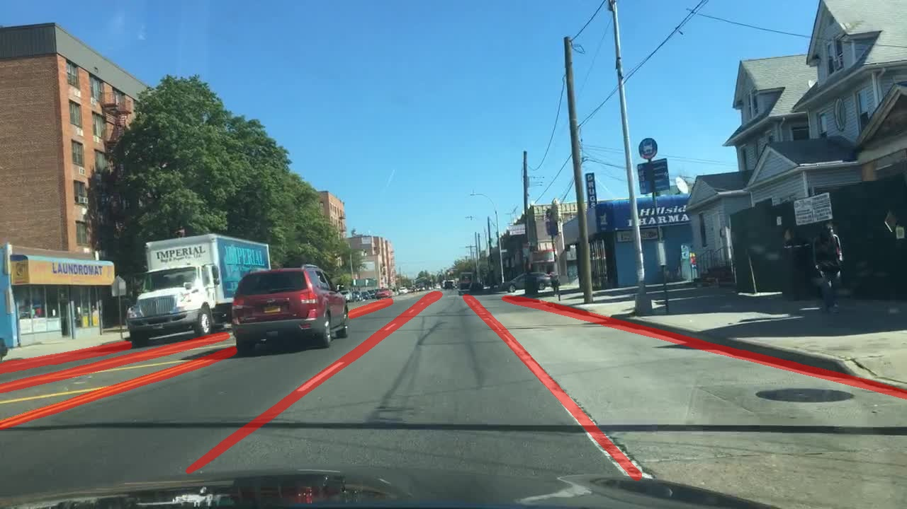
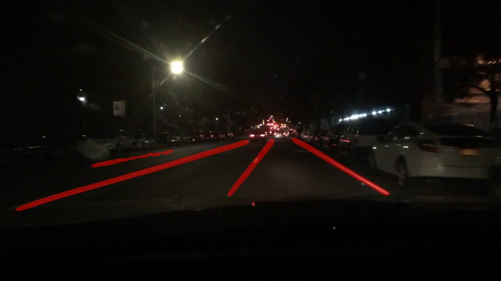
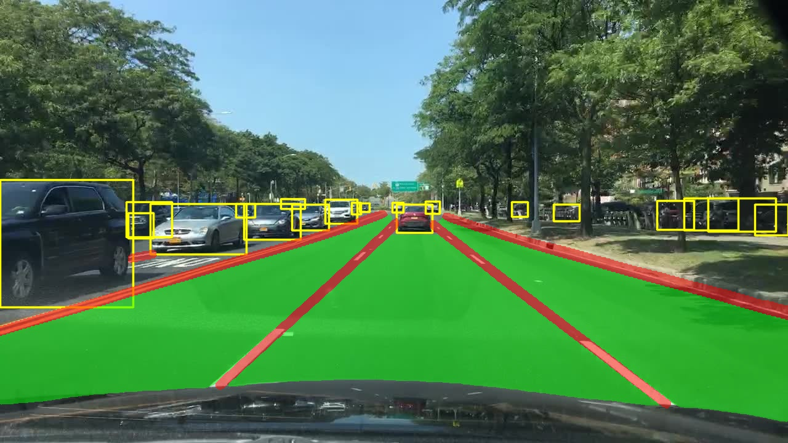
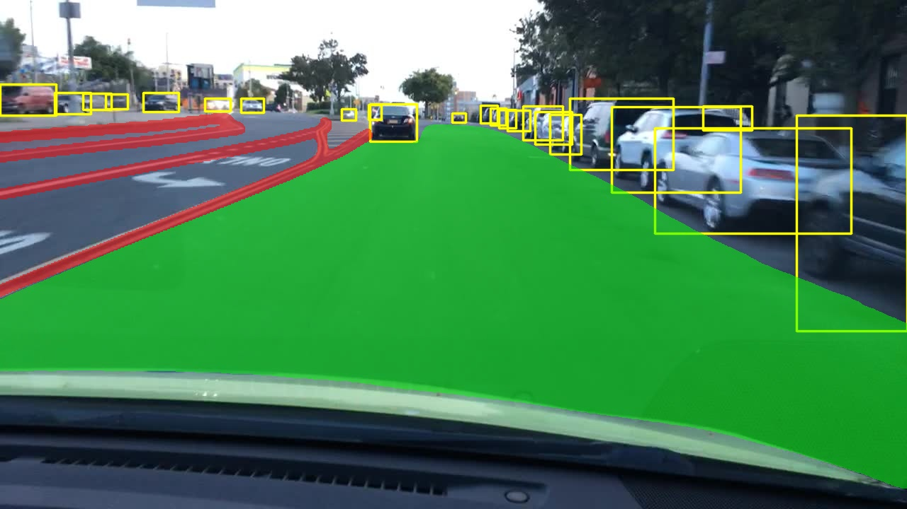
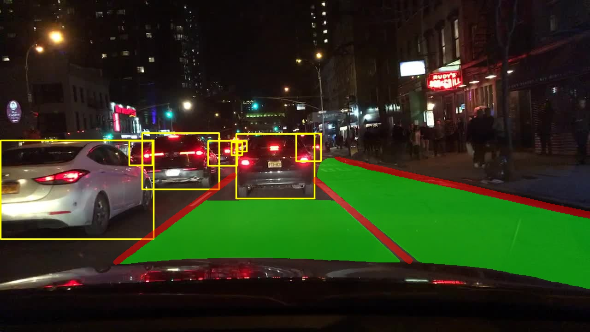
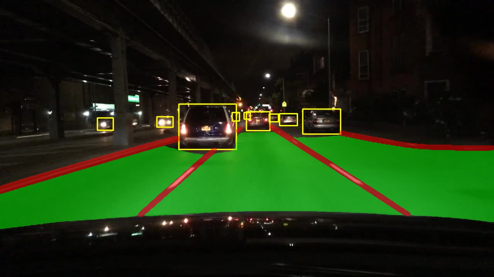

<div align="center">
<h1> YOLOPv2:rocket:: Better, Faster, Stronger for Panoptic driving Perception </h1>
<!-- <--!span><font size="5", > Efficient and Robust 2D-to-BEV Representation Learning via Geometry-guided Kernel Transformer
</font></span> -->

  Cheng Han, Qichao Zhao, Shuyi Zhang, Yinzi Chen, Zhenlin Zhang, Jinwei Yuan
<!-- <a href="https://scholar.google.com/citations?user=pCY-bikAAAAJ&hl=zh-CN">Jinwei Yuan</a> -->
<div><a href="https://arxiv.org/abs/2208.11434">[YOLOPv2 arXiv Preprint]</a></div> 

</div>

## News
* `August 30, 2022`: We've released the inference code / trained  <a href="https://github.com/CAIC-AD/YOLOPv2/releases/download/V0.0.1/yolopv2.pt">model</a> and published [](https://huggingface.co/spaces/hank1996/yolopv2)[web demo](https://huggingface.co/spaces/hank1996/yolopv2), just enjoy it !

* `August 24, 2022`: We've released the tech report for **YOLOPv2**. This work is still in progress and code/models are coming soon. Please stay tuned! ☕️
<!-- * `August 26, 2022`: We've upload the model for **YOLOPv2**. This version support for model training, validation and prediction. -->

## Introduction

:grin:We present an excellent multi-task network based on YOLOP:blue_heart:,which is called **YOLOPv2: Better, Faster, Stronger for Panoptic driving Perception**.
The advantages of **YOLOPv2** can be summaried as below:
* **Better**:clap:: we proposed the end-to-end perception network which possess better feature extraction backbone, better bag-of-freebies were developed for dealing with the training process.
* **Faster**:airplane:: we employed more efficient ELAN structures to achieve reasonable memory allocation for our  model. 
* **Stronger**:muscle:: the proposed model has stable network design and has powerful robustness for adapting to various scenarios .

[](https://paperswithcode.com/sota/traffic-object-detection-on-bdd100k?p=yolopv2-better-faster-stronger-for-panoptic)
[](https://paperswithcode.com/sota/drivable-area-detection-on-bdd100k?p=yolopv2-better-faster-stronger-for-panoptic)
[](https://paperswithcode.com/sota/lane-detection-on-bdd100k?p=yolopv2-better-faster-stronger-for-panoptic)

## Results
We used the BDD100K as our datasets,and experiments are run on **NVIDIA TESLA V100**.


### Web Demo

- Integrated into [Huggingface Spaces 🤗](https://huggingface.co/spaces/hank1996/yolopv2) using Gradio. Try out the Web Demo !

### Visualization
model : trained on the BDD100k dataset and test on T3CAIC camera.
<td></td>
  
  


### Model parameter and inference speed
|        Model       |    Size     |   Params   |  Speed (fps) |
|:------------------:|:-----------:|:----------:|:-----------:|
|       `YOLOP`      |     640     |    7.9M    |     49      |
|     `HybridNets`   |     640     |    12.8M   |     28      |
|    **`YOLOPv2`**   |     640     |  **38.9M** |   **91 (+42)** :arrow_double_up:   |


### Traffic Object Detection Result
<table>
<tr><th>Result </th><th>Visualization</th></tr>
<tr><td>
  

|        Model       |     mAP@0.5 (%)   |Recall (%)  |
|:------------------:|:------------:|:---------------:|
|     `MultiNet`     |        60.2      |   81.3     |  
|      `DLT-Net`     |        68.4      |  89.4     |
|   `Faster R-CNN`   |          55.6      | 77.2     |
|      `YOLOv5s`     |         77.2      | 86.8     |
|       `YOLOP`      |        76.5      | 89.2     |   
|     `HybridNets`   |          77.3      | **92.8**   | 
|    **`YOLOPv2`**   |       **83.4(+6.1)**:arrow_double_up:    |   91.1(-1.7)  :arrow_down:   |

</td><td>

<!-- ### Visualization -->

<!--    -->

</td></tr> </table>

### Drivable Area Segmentation
<table>

<tr><th>Result </th><th>Visualization</th></tr>
<tr><td>

|       Model      | Drivable mIoU (%) |——:relaxed:——|
|:----------------:|:-----------------:|---:|
|    `MultiNet`    |        71.6       |  |   
|     `DLT-Net`    |        71.3       || 
|     `PSPNet`     |        89.6       || 
|      `YOLOP`     |        91.5       || 
|     `HybridNets` |        90.5       || 
|     `YOLOPv2`    |   **93.2(+1.7)** :arrow_up:  |  | 

</td><td>

<!-- ### Visualization -->

<!--    -->

</td></tr> </table>

### Lane Line Detection
<table>
<tr><th>Result </th><th>Visualization</th></tr>
<tr><td>

|      Model       | Accuracy (%) | Lane Line IoU (%) |
|:----------------:|:------------:|:-----------------:|
|      `Enet`      |     34.12    |       14.64       |
|      `SCNN`      |     35.79    |       15.84       |
|    `Enet-SAD`    |     36.56    |       16.02       |
|      `YOLOP`     |     70.5     |        26.2       |
|   `HybridNets`   |     85.4     |        **31.6**     |
|    **`YOLOPv2`** |   **87.3(+1.9)**:arrow_up:   |      27.2(-4.4) :arrow_down: |
  
</td><td>

<!-- ### Visualization -->

<!--    -->

</td></tr> </table>

### Day-time and Night-time visualization results
<div align = 'None'>
  <a href="./">
  
  
  
  
  </a>
</div>


## Models

You can get the model from <a href="https://github.com/CAIC-AD/YOLOPv2/releases/download/V0.0.1/yolopv2.pt">here</a>.


### Demo Test

We provide two testing method.You can store the image or video.

```shell
python demo.py  --source data/example.jpg
```

<!-- ## Usage
coming soon. -->


### Third Parties Resource  

* YOLOPv2 NCNN C++ Demo: [YOLOPv2-ncnn](https://github.com/FeiGeChuanShu/YOLOPv2-ncnn) from [FeiGeChuanShu](https://github.com/FeiGeChuanShu/)
* YOLOPv2 ONNX and OpenCV DNN Demo: [yolopv2-opencv-onnxrun-cpp-py](https://github.com/hpc203/yolopv2-opencv-onnxrun-cpp-py) from [hpc203](https://github.com/hpc203/)


## License

YOLOPv2 is released under the [MIT Licence](LICENSE).

<!-- ## Citation
If you find YOLOPv2 is useful in your research or applications, please consider giving us a star &#127775; and citing it by the following BibTeX entry.
```bibtex
@article{GeokernelTransformer,
  title={Efficient and Robust 2D-to-BEV Representation Learning via Geometry-guided Kernel Transformer},
  author={Chen, Shaoyu and Cheng, Tianheng and Wang, Xinggang and Meng, Wenming and Zhang, Qian and Liu, Wenyu},
  journal={arXiv preprint arXiv:2206.04584},
  year={2022}
}
``` -->
